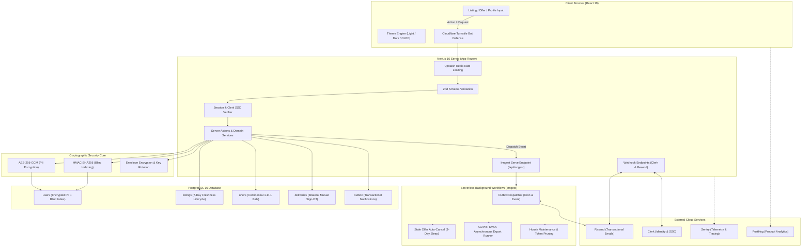

<div align="center">

# 🌐 Operis Platform — Modern & Güvenli Freelance İş ve Hizmet Pazaryeri

</div>

---

<div align="center">

[](#english-version)
&nbsp;&nbsp;&nbsp;&nbsp;
[](#turkish-version)

</div>

---

<div align="center">


[](https://operis.pro)
[](https://vellium.dev)


</div>

---

<a id="english-version"></a>
# English Version

<div align="center">
  
  <h3>Operis Platform — Next-Gen Software & Technology Freelance Marketplace</h3>
  <p><em>Direct, Privacy-First, Zero-Commission Freelance Platform for Developers, Designers & Tech Specialists</em></p>
  <p><strong>Project Website: <a href="https://operis.pro">operis.pro</a> &bull; Developed & Published by <a href="https://vellium.dev">Vellium</a></strong></p>
</div>

<br>

## 💻 Project Overview

**Operis Platform** is an enterprise-grade, privacy-first software and technology freelancing marketplace engineered with **Next.js 16 (App Router)**, **React 19**, **TypeScript 5.8**, **Tailwind CSS**, and **Drizzle ORM** over **PostgreSQL**. Powered by **Inngest** serverless durable workflows, **Clerk** identity management, and **Resend** transactional communications, it empowers clients and tech specialists to discover, propose, and collaborate on software projects directly—completely eliminating intermediaries, escrow bottlenecks, and predatory platform commissions.

Traditional freelance platforms lock users behind opaque rating algorithms, impose high commissions (often 10%–20%), force artificial milestone escrow holds, and fragment users into rigid "employer" vs. "freelancer" silos. **Operis Platform** re-architects this model around integrity, speed, and privacy:

- **Single Dual-Role Accounts**: Any registered user can both publish technology listings and place confidential proposals from the exact same account without switching profiles.
- **7-Day Listing Freshness**: To eliminate stale, abandoned, or zombie postings, every listing automatically expires after 7 days. The first publication date is strictly immutable upon reactivation.
- **Private 1-to-1 Offers**: Proposals are strictly confidential between the specialist and the listing owner. Competing bids and price negotiations remain private.
- **Direct Privacy-Preserving Contact Handoff**: Once an offer is accepted, the platform securely unlocks verified direct communication (verified email always; phone only if explicitly opted in).
- **Bilateral Mutual Delivery Verification**: Projects and reputation scores appear on public profiles only after both parties mutually confirm successful project completion.
- **Serverless Durable Background Workflows**: Eliminates costly 24/7 background servers by orchestrating outbox email dispatch, delayed 3-day offer cancellations, and asynchronous GDPR exports using **Inngest**.
- **Enterprise-Grade Cryptographic Security**: Sensitive personally identifiable information (PII) is encrypted at rest using **AES-256-GCM** with **HMAC blind indexing** and **envelope encryption** for high-speed queries without leaking plaintext.

---

## 🚀 Key Features

- **Zero Platform Commission**: No hidden fees, no percentage cuts, and no escrow deductions. Direct specialist-to-client value transfer.
- **Dual-Role Universal Accounts**: Unified profile architecture supporting simultaneous project publishing and confidential proposal submission.
- **7-Day Freshness Lifecycle**: Automated lifecycle system ensuring the marketplace feed only contains active, high-intent listings with an immutable initial publication timestamp.
- **Confidential 1-to-1 Bidding**: No public bidding wars. Exactly one pending proposal per listing per specialist with full private messaging once accepted.
- **Bilateral Mutual Delivery Sign-Off**: Trust and portfolio verification achieved through two-way confirmation—neither party can unilaterally forge reviews.
- **Serverless Durable Workflows (Inngest)**:
  - **Sub-Second Outbox Dispatch**: Real-time event triggers (`operis/outbox.process`) paired with a 2-minute recurring cron fallback for guaranteed email delivery.
  - **3-Day Delayed Offer Auto-Cancellation**: Long-running workflow using `step.sleep("3 days")` to automatically release stale proposals and send localized notifications.
  - **Asynchronous KVKK / GDPR Data Export**: Offloads memory-intensive zip/json export processing to prevent serverless gateway timeouts.
  - **Automated Hourly Maintenance**: Automated cleanup of expired listings, obsolete OTP verification codes, and rate-limiting buckets.
- **Enterprise Authentication & Social SSO (Clerk)**: Smooth OAuth onboarding (Google, GitHub) alongside native credentials, synchronized via cryptographic Svix webhooks.
- **Cryptographic PII Protection & Envelope Encryption**:
  - **AES-256-GCM Encryption**: Secure authenticated encryption for contact details, phone numbers, and sensitive client credentials.
  - **Blind Indexing (HMAC-SHA256)**: Deterministic cryptographic hashing allowing indexed database lookups without exposing plaintext emails or identity fields.
  - **Envelope Encryption & Key Rotation**: Multi-slot key management ensuring seamless credential updates without platform downtime.
- **Zero-Trust Bot Defense & Distributed Rate Limiting**:
  - **Cloudflare Turnstile**: Frictionless bot protection and CAPTCHA defense across authentication and proposal forms.
  - **Upstash Redis**: Edge-ready distributed sliding-window rate limiting safeguarding sensitive API routes.
- **Full-Stack Observability & Telemetry**:
  - **Sentry**: Distributed client, server, and edge exception tracking with performance monitoring and session profiling.
  - **PostHog**: Privacy-preserving product analytics and conversion funnel measurement.
- **Triple Semantic Theme Engine**: Hand-crafted themes including Clean Light, Modern Dark, and Pure OLED Pitch Black (`#000000`) for developer-friendly night mode.
- **Zero-Emoji Professional Design Standard**: Strictly professional aesthetics using custom typography and modern SVG iconography (**Lucide React**), backed by automated CI emoji linters.
- **100% Internationalization (i18n)**: Fully localized Turkish (`tr`) and English (`en`) interfaces with automated dictionary parity verification via **next-intl**.
- **Comprehensive Quality Gates**: Over 5,000+ unit, integration, and accessibility tests verified via **Vitest**, **Playwright**, and **@axe-core/playwright** (WCAG 2.1 AA compliant).

---

## 🛠️ Tech Stack

<div align="center">


</div>

### Frontend & User Interface
- **Next.js 16.3 (App Router)**: Modern React Server Components (RSC), dynamic metadata generation, route handlers, and streaming SSR
- **React 19.2**: Concurrent features, Server Actions, modern hooks, and reactive transitions
- **TypeScript 5.8**: Strict type-safety, comprehensive domain models, and zero `any` policy
- **Tailwind CSS 3.4**: Responsive layout grid, HSL-based design tokens, custom glassmorphism, and OLED true-black support
- **Lucide React**: Crisp, modern SVG iconography designed for professional enterprise tooling
- **Zod 3.24**: Runtime input validation for forms, API endpoints, and server action payloads
- **PostHog JS 1.430**: Privacy-preserving client-side product analytics and event telemetry

### Backend, Database & Cryptography
- **PostgreSQL 16+**: High-performance relational database with ACID compliance and PostgREST RLS lockdown
- **Drizzle ORM 0.41**: Type-safe SQL query builder and schema management with zero runtime overhead
- **AES-256-GCM & HMAC-SHA256**: Authenticated symmetric cipher for PII encryption with blind indexing
- **Envelope Encryption (`crypto/envelope`)**: Enterprise data-key wrapping architecture with key rotation support
- **Transactional Outbox Pattern**: Reliable asynchronous notification delivery preventing lost email alerts
- **Session Security & Clerk SSO**: Cryptographically signed, HTTP-only SameSite cookies and OAuth identity bridging

### Cloud Integrations & Background Workflows
- **Inngest 4.20**: Serverless event-driven background job orchestration, durable multi-step workflows, retry backoffs, and scheduled crons
- **Resend**: Transactional email delivery, verified templates, audience contact pool synchronization, and webhook tracking
- **Upstash Redis**: Edge-compatible distributed sliding-window rate limiting for security-critical endpoints
- **Cloudflare Turnstile**: Zero-interaction CAPTCHA and anti-bot verification
- **Sentry 10.74**: Full-stack exception tracking, session replay, and performance tracing across client, server, and edge

### Quality Assurance & Automated Testing
- **Vitest 3.0**: Blazing-fast unit and integration test runner (5,000+ assertions across 50 test suites)
- **Playwright 1.51**: End-to-end browser automation across Chromium, Firefox, and WebKit
- **@axe-core/playwright**: Automated accessibility audit enforcing WCAG 2.1 Level AA compliance
- **Custom CI Audits**: Automated linting for emoji usage (`pnpm audit:emoji`) and i18n dictionary key parity (`pnpm audit:i18n`)

---

## 📁 Project Structure

```tree
operis-platform/
├── .github/                        # GitHub Actions CI/CD workflows
│   └── workflows/ci.yml            # Automated test, lint, typecheck & build pipeline
├── db/                             # Database schema, relations & seed data
│   ├── migrations/                 # Drizzle SQL migration files (0000 - 0018)
│   ├── schema/                     # Drizzle ORM relational table definitions
│   │   ├── users.ts                # User identities, credentials, roles & Clerk sync
│   │   ├── listings.ts             # Project postings, lifecycle & categories
│   │   ├── offers.ts               # Confidential 1-to-1 proposals & acceptance
│   │   ├── deliveries.ts           # Bilateral delivery confirmations
│   │   ├── reviews.ts              # Verified mutual feedback & scores
│   │   ├── outbox.ts               # Transactional notification outbox
│   │   └── export-jobs.ts          # GDPR / KVKK export job ledger & lease tokens
│   ├── seeds/                      # Seed generators (users, listings, offers, engagements)
│   └── index.ts                    # Drizzle client instance & connection pool
├── deploy/                         # Production systemd daemon services & timers
│   ├── operis-worker.service       # Standalone background worker daemon service
│   └── operis-worker-check.timer   # Worker health check timer
├── docs/                           # Master specifications, architecture & operations
│   ├── README.md                   # Central documentation index & navigation map
│   ├── production-readiness/       # Launch review, risk register & incident runbooks
│   ├── search-and-ai/              # SEO, GEO, AEO & AI discovery master specs
│   ├── architecture/               # Master functional spec & build manifest
│   ├── operations/                 # Worker daemon runbook & go-live checklists
│   ├── security/                   # Key rotation protocol & cryptosystem docs
│   ├── audit/                      # Security & compliance audit remediation reports
│   ├── sozlesme-ornekleri/         # 10 freelance contracts & legal template library
│   ├── assets/screenshots/         # UI verification & design proof captures
│   └── Operis_Search_100_v5_1/     # Semantic search taxonomy, specs & benchmark datasets
├── i18n/                           # Internationalization setup (next-intl)
│   ├── request.ts                  # Server-side locale resolution & dictionary loader
│   └── routing.ts                  # Localized routing configuration (tr/en prefixes)
├── legal/                          # Markdown legal contracts & policy templates
│   ├── privacy-policy.md           # GDPR & KVKK compliant privacy terms
│   └── terms-of-service.md         # User agreement, bilateral rules & disclaimer
├── messages/                       # Localized translation dictionaries
│   ├── en.json                     # English locale dictionary
│   └── tr.json                     # Turkish locale dictionary
├── public/                         # Public static branding assets & logos
│   ├── operis-logo-acik.svg        # Vector logo (Light background)
│   ├── operis-logo-koyu.svg        # Vector logo (Dark background)
│   ├── operis-logo-email.png       # High-resolution PNG logo for email clients
│   ├── operis-favicon.svg          # High-resolution vector circular favicon
│   └── preview-emails.html         # Live transactional email preview gallery
├── scripts/                        # Database, worker & code auditing utilities
│   ├── migrate.ts                  # Database migration executor
│   ├── seed.ts                     # Initial taxonomy & legal versions seed
│   ├── worker-daemon.ts            # Standalone worker daemon for VPS environments
│   ├── backfill-pii-keys.ts        # Cryptographic key rotation & backfill tool
│   ├── check-worker-health.ts      # Automated worker daemon health monitor
│   ├── check-emojis.ts             # Strict zero-emoji compliance scanner
│   └── check-i18n-parity.ts        # Automated TR-EN dictionary key parity validator
├── sentry.*.config.ts              # Sentry configuration (client, server, edge)
├── src/                            # Application source code
│   ├── app/                        # Next.js App Router architecture
│   │   ├── [locale]/               # Localized route segments (/tr, /en)
│   │   │   ├── (auth)/             # Login, register & password recovery
│   │   │   ├── (dashboard)/        # User dual-role dashboard & listing manager
│   │   │   ├── listings/           # Public listings catalog, search & details
│   │   │   ├── profile/            # Public specialist portfolios & reviews
│   │   │   ├── legal/              # Legal agreements & KVKK consent views
│   │   │   ├── layout.tsx          # Root localized layout with theme & telemetry
│   │   │   └── page.tsx            # High-conversion landing & hero showcase
│   │   ├── admin/                  # Protected administrative console & dispute manager
│   │   ├── api/                    # API route handlers
│   │   │   ├── inngest/            # Inngest serverless endpoint (/api/inngest)
│   │   │   ├── webhooks/           # Clerk and Resend webhook listeners
│   │   │   ├── listings/           # Feed, search, publish & lifecycle routes
│   │   │   ├── offers/             # Proposal submissions, revisions & status
│   │   │   ├── account/            # PII management & asynchronous GDPR export
│   │   │   └── health/             # Microservice observability endpoint
│   │   ├── global-error.tsx        # Zero-dependency root crash fallback
│   │   └── not-found.tsx           # Bilingual 404 handler
│   ├── components/                 # Reusable UI component library
│   │   ├── admin/                  # Admin tables, disputes & system metrics
│   │   ├── analytics/              # PostHog privacy-preserving analytics provider
│   │   ├── auth/                   # Login/register forms, Clerk SSO & social buttons
│   │   ├── layout/                 # Header, navbar, footer, theme & language switchers
│   │   ├── listings/               # Listing card, feed, revisions modal, proposal drawer
│   │   ├── security/               # Turnstile bot widget & 2FA / TOTP controls
│   │   └── ui/                     # Accessible button, dialog, input, badge, skeleton
│   ├── config/                     # Type-safe environment validation
│   │   └── env.ts                  # Zod environment schema with fail-fast validations
│   ├── instrumentation.ts          # Server runtime instrumentation & Sentry hook
│   ├── lib/                        # Core utilities, crypto, auth & database services
│   │   ├── crypto/                 # AES-256-GCM, HMAC blind indexing & envelope encryption
│   │   ├── db/                     # Drizzle client, connection pool, advisory locks
│   │   ├── email/                  # Resend provider, templates & email preview renderer
│   │   ├── inngest/                # Inngest client & durable serverless workflow functions
│   │   │   ├── client.ts           # Resilient Inngest client with typed event schemas
│   │   │   └── functions/          # Outbox, maintenance, stale-offers, privacy-export
│   │   └── security/               # Upstash Redis rate limiter, Turnstile & JSON-LD
│   ├── modules/                    # Domain-driven modular services
│   │   ├── admin/                  # Administrative service & access guard
│   │   ├── auth/                   # Session, password reset, 2FA/TOTP & Clerk sync
│   │   ├── email/                  # Resend audience contact pool manager
│   │   ├── engagements/            # Active project work, cancellation & mutual delivery
│   │   ├── listings/               # Listing CRUD, 7-day expiration & feed service
│   │   ├── notifications/          # Transactional outbox & notification fanout
│   │   ├── offers/                 # Confidential proposals & stale offer cancellation
│   │   └── privacy/                # Encrypted GDPR / KVKK streaming export engine
│   └── styles/                     # CSS tokens and design system variables
├── tests/                          # Automated testing suites
│   ├── unit/                       # Vitest unit tests (crypto, validation, i18n, inngest)
│   ├── integration/                # Database service, RLS, outbox & lifecycle tests
│   ├── a11y/                       # Axe-core accessibility compliance tests
│   └── e2e/                        # Playwright end-to-end browser workflows
├── drizzle.config.ts               # Drizzle Kit CLI configuration
├── next.config.ts                  # Next.js compiler, headers & security policy
├── package.json                    # Dependencies & npm scripts
├── tailwind.config.ts              # Tailwind CSS theme tokens & OLED palette
└── tsconfig.json                   # Strict TypeScript compiler options
```

---

## 🔐 Architecture & Data Security Flow



### Data Storage & Cryptographic Specifications

| Data Domain | Encryption & Integrity Standard | Description |
| :--- | :--- | :--- |
| **User Identity & Contact (PII)** | **AES-256-GCM + HMAC Blind Index** | Verified email, phone number, and real name are encrypted at rest; queryable via blind hashes. |
| **Envelope Encryption** | **KMS-Ready Dual-Key Architecture** | Secure data encryption keys wrapped with system master keys (`crypto/envelope`) with seamless rotation. |
| **Listings Catalog** | **Relational (Drizzle ORM) + Lifecycle Engine** | Automatic 7-day expiration date enforcement. Immutable initial publication timestamp. |
| **Confidential Offers** | **Isolated 1-to-1 Access Control** | Visible strictly to listing owner and proposing specialist. Maximum 1 pending proposal per listing. |
| **Project Delivery** | **Bilateral State Machine** | Mutual confirmation required from both client and specialist before review publication. |
| **Session Security** | **Signed HTTP-Only Cookies & Clerk SSO** | Timing-safe token comparison, SameSite=Lax, Secure flags, and Clerk webhook sync. |
| **Transactional Outbox** | **Atomic Database Writes** | Notification payloads written in the same SQL transaction as domain operations to guarantee delivery. |
| **Serverless Workflows** | **Inngest Durable Execution** | Cryptographically signed webhooks (`INNGEST_SIGNING_KEY`) executing outbox, cancel, and maintenance jobs. |
| **Distributed Rate Limiting** | **Upstash Redis Sliding Window** | Real-time rate limiting for authentication, phone verification, and proposal submission. |

---

## ⚙️ Installation & Usage

### Prerequisites
- **Node.js**: Version 20.0.0 or higher (Node 24 LTS recommended)
- **pnpm**: Version 10.0.0 or higher
- **PostgreSQL**: Version 16 or higher (Local installation, Docker, or hosted instance)

### Step-by-Step Developer Setup

1. **Clone the Repository:**
   ```bash
   git clone https://github.com/emirtdede/operis-platform.git
   cd operis-platform
   ```

2. **Install Node Dependencies:**
   ```bash
   pnpm install
   ```

3. **Configure Environment Variables:**
   Copy `.env.example` to create your local `.env.local` file:
   ```bash
   cp .env.example .env.local
   ```
   Generate strong 64-character hexadecimal keys (32 bytes) for cryptography:
   ```bash
   # Linux / macOS / Git Bash:
   openssl rand -hex 32

   # Windows PowerShell:
   -join ((1..32) | ForEach-Object { '{0:x2}' -f (Get-Random -Max 256) })
   ```
   Configure the following essential credentials in your `.env.local`:
   - Database: `DATABASE_URL` (PostgreSQL 16 connection string)
   - Cryptography: `PII_ENCRYPTION_KEY_CURRENT` and `PII_HMAC_KEY`
   - Inngest (Serverless Jobs): `INNGEST_EVENT_KEY` and `INNGEST_SIGNING_KEY`
   - Clerk (Authentication): `NEXT_PUBLIC_CLERK_PUBLISHABLE_KEY` and `CLERK_SECRET_KEY`
   - Resend (Email Delivery): `RESEND_API_KEY`
   - Upstash Redis (Rate Limiting): `UPSTASH_REDIS_REST_URL` and `UPSTASH_REDIS_REST_TOKEN`
   - Turnstile (Bot Defense): `NEXT_PUBLIC_TURNSTILE_SITE_KEY` and `TURNSTILE_SECRET_KEY`

4. **Initialize and Seed the Database:**
   ```bash
   # Generate Drizzle migration files
   pnpm db:generate

   # Apply schema migrations to PostgreSQL
   pnpm db:migrate

   # Seed default categories, skills & legal policy versions
   pnpm db:seed
   ```

5. **Start the Development Servers:**
   ```bash
   # Start Next.js development server
   pnpm dev

   # In a separate terminal, start local Inngest dev server:
   pnpm inngest:dev
   ```
   Open [http://localhost:3000](http://localhost:3000) in your browser.  
   The Inngest local dashboard will be accessible at [http://localhost:8288](http://localhost:8288).

6. **Run Quality Verification & Testing Suites:**
   ```bash
   # TypeScript strict type checking
   pnpm typecheck

   # ESLint code quality scan
   pnpm lint

   # Code formatting verification
   pnpm format:check

   # Internationalization dictionary parity check (TR <-> EN)
   pnpm audit:i18n

   # Zero-emoji compliance audit
   pnpm audit:emoji

   # Unit test suite (Vitest)
   pnpm test:unit

   # Integration test suite (PostgreSQL 16)
   pnpm test:integration

   # End-to-end browser tests (Playwright)
   pnpm test:e2e

   # Automated accessibility audit (Axe-core WCAG 2.1 AA)
   pnpm test:a11y
   ```

7. **Production Build & Execution:**
   ```bash
   # Compile optimized production bundle
   pnpm build

   # Start production server
   pnpm start
   ```

---

## 📦 Deployment & Operational Notes

- **Serverless Workflows (Recommended / $0 Overhead)**: When deployed to modern serverless platforms (Vercel, Netlify, Cloudflare), background jobs are automatically executed via **Inngest** (`/api/inngest`). No persistent Linux virtual servers or cron daemons are required, fitting comfortably within Inngest's generous free tier (50,000 monthly executions).
- **Standalone Daemon Mode (Self-Hosted / VPS)**: For traditional Linux VPS or Docker deployments, Operis provides `scripts/worker-daemon.ts` (`pnpm worker:daemon`) with systemd service files located in `deploy/`.
- **Docker Containerization**: Operis can be deployed using standard Node.js multi-stage Dockerfiles.
- **Security Headers**: HSTS, CSP (Content Security Policy), X-Frame-Options, and Referrer-Policy are strictly configured in `next.config.ts`.
- **Health Check & Observability**: Microservice observability endpoint available at `/api/health`, complemented by Sentry error tracing and PostHog analytics.

---

## ⚖️ License

Distributed under the **MIT License**. See [`LICENSE`](./LICENSE) for more information.

**Project Website**: [operis.pro](https://operis.pro) &bull; **Developer & Publisher**: [Vellium](https://vellium.dev)

---

<br>

---

<a id="turkish-version"></a>
# Türkçe Versiyon

<div align="center">
  
  <h3>Operis Platform — Yeni Nesil Yazılım ve Teknoloji Freelance Pazaryeri</h3>
  <p><em>Yazılım Geliştiriciler, Tasarımcılar ve Teknoloji Uzmanları İçin Komisyonsuz, Aracısız ve Gizlilik Odaklı İş Platformu</em></p>
  <p><strong>Proje Web Sitesi: <a href="https://operis.pro">operis.pro</a> &bull; Geliştirici ve Yayıncı: <a href="https://vellium.dev">Vellium</a></strong></p>
</div>

<br>

## 💻 Project Overview (Proje Genel Bakışı)

**Operis Platform**, **Next.js 16 (App Router)**, **React 19**, **TypeScript 5.8**, **Tailwind CSS** ve **PostgreSQL** üzerinde **Drizzle ORM** teknolojileriyle geliştirilmiş, kurumsal düzeyde ve gizlilik odaklı bir yazılım/teknoloji serbest çalışma (freelance) pazaryeridir. **Inngest** sunucusuz iş akışları, **Clerk** kurumsal kimlik yönetimi ve **Resend** e-posta dağıtım altyapısıyla güçlendirilen sistem; uzmanlar ile işverenleri doğrudan bir araya getirerek aracıları, yüksek komisyon kesintilerini ve havuz hesabı (escrow) gecikmelerini tamamen ortadan kaldırır.

Geleneksel serbest çalışma platformları kullanıcıları tek yönlü rollere hapseder, %10 ile %20 arasında yüksek komisyonlar keser ve iletişimi platform içine kilitleyerek hantal süreçler yaratır. **Operis Platform**, bu yapıyı dürüstlük, hız ve veri güvenliği ilkeleriyle yeniden inşa eder:

- **Tek Hesap, Çift Rol Mimarisi**: Kullanıcılar ayrı hesaplar açmaya gerek kalmaksızın aynı profille hem teknoloji ilanı verebilir hem de diğer ilanlara gizli teklif sunabilir.
- **7 Günlük İlan Tazeliği Kuralı**: Platformda terk edilmiş veya güncelliğini yitirmiş ilan kalmaması için tüm ilanlar 7 gün sonra otomatik olarak yayından kalkar. İlan yeniden etkinleştirilse dahi ilk yayın tarihi değiştirilemez.
- **Gizli Bire Bir Teklifler**: Verilen teklifler yalnızca işveren ile uzman arasında gizli kalır. Fiyat kırma yarışları veya açık teklif savaşları engellenir.
- **Doğrudan ve Güvenli İletişim Devri**: Teklif onaylandığı anda tarafların doğrulanmış doğrudan iletişim bilgileri (doğrulanmış e-posta; isteğe bağlı telefon) güvenli şekilde paylaşılır.
- **Karşılıklı ve Çift Taraflı Teslim Doğrulaması**: Bir projenin tamamlandığı ve profil değerlendirmeleri, ancak her iki taraf da işin eksiksiz teslim edildiğini onayladığında yayına girer.
- **Sunucusuz Arka Plan İş Akışları (Inngest)**: Sürekli çalışan sunucu kiralama maliyetini sıfıra indirerek bildirim dağıtımını, 3 günlük yanıtsız teklif iptallerini ve KVKK veri aktarımlarını modern sunucusuz iş akışlarıyla yürütür.
- **Askeri Düzeyde Kişisel Veri Güvenliği (KVKK / GDPR)**: Hassas kişisel veriler veritabanında **AES-256-GCM** şifrelemesi, **HMAC-SHA256 kör indeksleme (blind indexing)** ve **zarf tipi şifreleme (envelope encryption)** yöntemleriyle korunur.

---

## 🚀 Key Features (Önemli Özellikler)

- **Sıfır Platform Komisyonu**: Hiçbir gizli ücret, yüzde kesintisi veya aracı maliyeti yoktur. İşveren ve uzman arasındaki değer doğrudan aktarılır.
- **Evrensel Çift Rol Desteği**: Tek bir kullanıcı oturumu ile aynı anda hem proje ilanı açabilme hem de projelere gizli teklif verebilme imkanı.
- **7 Günlük Otomatik Yaşam Döngüsü**: İlanların güncelliğini garanti altına alan otomatik sonlanma ve değişmez ilk yayın tarihi denetimi.
- **Gizli Bire Bir Teklif Yönetimi**: Açık teklif listeleri yerine işveren ile serbest çalışan arasında gizli kalan teklif ve mesajlaşma süreci.
- **Çift Taraflı Teslim Doğrulama**: Tek taraflı sahte puanlamaların ve haksız yorumların önüne geçen karşılıklı teslimat onay mekanizması.
- **Sunucusuz Dayanıklı İş Akışları (Inngest)**:
  - **Milisaniyelik Outbox Dağıtımı**: Anlık olay tetikleyicisi (`operis/outbox.process`) ve 2 dakikalık yedek cron mekanizması ile e-postaların eksiksiz iletimi.
  - **3 Günlük Yanıtsız Teklif Otomatik İptali**: `step.sleep("3 days")` ile işverenin yanıtlamadığı teklifleri otomatik serbest bırakma ve iki dilli bildirim.
  - **Asenkron KVKK / GDPR Veri Dışa Aktarımı**: Büyük boyutlu JSON/ZIP dışa aktarım işlemlerinin sunucu zaman aşımına uğramadan asenkron tamamlanması.
  - **Saatlik Otomatik Bakım**: Süresi dolan ilanların kapatılması, eski OTP doğrulama kodlarının ve hız sınırlama önbelleklerinin temizlenmesi.
- **Kurumsal Kimlik Doğrulama & Sosyal Giriş (Clerk)**: Google ve GitHub gibi tek tıkla OAuth entegrasyonu ve kriptografik Svix webhook veritabanı senkronizasyonu.
- **Kriptografik Veri Güvenliği & Zarf Şifreleme**:
  - **AES-256-GCM Şifreleme**: Telefon, e-posta ve iletişim bilgilerinin disk üzerinde şifreli saklanması.
  - **Kör İndeksleme (HMAC-SHA256)**: Veritabanında açık metin aramaya gerek kalmadan güvenli ve hızlı sorgulama imkanı.
  - **Zarf Şifreleme (Envelope Encryption) & Rotasyon**: Çok yuvalı anahtar yönetimi ile kesintisiz güvenlik güncellemesi.
- **Sıfır Güven Bot Koruması & Dağıtık Hız Sınırlama**:
  - **Cloudflare Turnstile**: Kullanıcıyı yormayan, CAPTCHA gerektirmeyen akıllı bot koruması.
  - **Upstash Redis**: Kritik API uç noktalarını koruyan uç nokta uyumlu kayan pencere (sliding-window) hız sınırlayıcı.
- **Uçtan Uca Telemetri & İzleme**:
  - **Sentry**: İstemci, sunucu ve edge katmanlarında gerçek zamanlı hata yakalama ve performans analitiği.
  - **PostHog**: Gizlilik odaklı kullanıcı davranışı ve ürün etkileşim analitiği.
- **3 Dinamik Arayüz Teması**: Temiz Açık (Light), Modern Koyu (Dark) ve OLED ekranlar için saf siyah (`#000000`) True Black teması.
- **Sıfır Emoji Standartı**: Profesyonel kurumsal kimliği korumak için tasarlanmış temiz tipografi, modern SVG ikon seti (**Lucide React**) ve otomatik CI emoji denetleyicisi.
- **%100 İki Dilli Altyapı (i18n)**: **next-intl** ile hazırlanmış, Türkçe (`tr`) ve İngilizce (`en`) sözlük anahtarları %100 senkronize edilmiş yerelleştirme sistemi.
- **Kapsamlı Test ve Kalite Kapıları**: **Vitest**, **Playwright** ve **Axe-core** ile 5.000'in üzerinde birim, entegrasyon ve erişilebilirlik (WCAG 2.1 AA) testi.

---

## 🛠️ Tech Stack (Teknoloji Yığını)

<div align="center">


</div>

### Ön Yüz ve Kullanıcı Deneyimi
- **Next.js 16.3 (App Router)**: React Server Components (RSC), dinamik metaveri üretimi, rota işleyicileri ve akışlı sunucu taraflı render (SSR)
- **React 19.2**: Sunucu eylemleri (Server Actions), modern hook yapısı ve geçiş optimizasyonları
- **TypeScript 5.8**: Sıkı tip denetimi, sıfır `any` prensibi ve tam kapsamlı veri modelleri
- **Tailwind CSS 3.4**: CSS değişkenleri, duyarlı grid sistemi ve OLED True Black renk paleti
- **Lucide React**: Modern kurumsal uygulamalara özel tutarlı SVG ikon kütüphanesi
- **Zod 3.24**: Güçlü form, rota ve sunucu eylemi girdi doğrulama şemaları
- **PostHog JS 1.430**: Gizlilik odaklı istemci taraflı ürün analitiği ve etkileşim takibi

### Arka Yüz, Veritabanı ve Kriptografi
- **PostgreSQL 16+**: ACID uyumlu, yüksek performanslı kurumsal ilişkisel veritabanı ve PostgREST RLS koruması
- **Drizzle ORM 0.41**: Tip güvenli SQL sorgu kurucusu ve sıfır çalışma zamanı ek yükü
- **AES-256-GCM & HMAC-SHA256**: Hassas kişisel verilerin (PII) şifrelenmesi ve kör indeksleme motoru
- **Zarf Şifreleme (`crypto/envelope`)**: Sistem anahtarı ile korunan veri anahtarı mimarisi ve rotasyon desteği
- **Transactional Outbox Deseni**: Bildirimlerin ve e-postaların kaybolmasını önleyen atomik veritabanı işlem kuyruğu
- **Oturum Güvenliği & Clerk SSO**: Kriptografik imzalı HTTP-Only çerezler ve sosyal kimlik köprüsü

### Bulut Entegrasyonları ve Sunucusuz İş Akışları
- **Inngest 4.20**: Sunucusuz olay güdümlü arka plan iş orkestrasyonu, dayanıklı çok adımlı iş akışları, otomatik yeniden deneme ve zamanlanmış cron görevleri
- **Resend**: Yüksek teslimat oranlı kurumsal e-posta servisi, modern şablonlar, kişi havuzu senkronizasyonu ve webhook dinleyicileri
- **Upstash Redis**: Güvenlik açısından kritik uç noktalar için sunucusuz dağıtık kayan pencere hız sınırlaması
- **Cloudflare Turnstile**: Kullanıcı dostu akıllı bot savunması ve form güvenliği
- **Sentry 10.74**: İstemci, sunucu ve edge düzeyinde tam kapsamlı hata izleme ve telemetri

### Kalite Güvencesi ve Otomasyon
- **Vitest 3.0**: Hızlı birim ve entegrasyon test motoru (50 test süitinde 5.000+ doğrulama)
- **Playwright 1.51**: Chromium, Firefox ve WebKit üzerinde uçtan uca (E2E) tarayıcı testleri
- **@axe-core/playwright**: WCAG 2.1 Seviye AA standartlarında otomatik erişilebilirlik denetimi
- **Özel CI Denetimleri**: Emoji kullanımını engelleyen `pnpm audit:emoji` ve dil sözlüklerini doğrulayan `pnpm audit:i18n`

---

## 📁 Project Structure (Proje Klasör Yapısı)

```tree
operis-platform/
├── .github/                        # GitHub Actions CI/CD iş akışları
│   └── workflows/ci.yml            # Otomatik test, derleme ve lint kontrolü
├── db/                             # Veritabanı şeması, ilişkiler ve tohum verileri
│   ├── migrations/                 # Drizzle SQL migrasyon dosyaları (0000 - 0018)
│   ├── schema/                     # Drizzle ORM tablo modelleri
│   │   ├── users.ts                # Kullanıcı kimlikleri, roller ve Clerk senkronizasyonu
│   │   ├── listings.ts             # İlanlar, kategoriler ve 7 günlük yaşam döngüsü
│   │   ├── offers.ts               # Bire bir gizli teklifler ve kabul durumu
│   │   ├── deliveries.ts           # Karşılıklı çift taraflı teslimat onayları
│   │   ├── reviews.ts              # Doğrulanmış müşteri ve uzman değerlendirmeleri
│   │   ├── outbox.ts               # Atomik bildirim kuyruğu (Transactional Outbox)
│   │   └── export-jobs.ts          # KVKK veri dışa aktarım iş defteri ve kilit tokenları
│   ├── seeds/                      # Tohum veri üreticileri (kullanıcılar, ilanlar, teklifler)
│   └── index.ts                    # Drizzle bağlantı havuzu ve veritabanı örneği
├── deploy/                         # Üretim ortamı için systemd servisleri ve zamanlayıcılar
│   ├── operis-worker.service       # Bağımsız arka plan işçi servisi
│   └── operis-worker-check.timer   # İşçi sağlık kontrolü zamanlayıcısı
├── docs/                           # Ana dokümantasyon, mimari ve operasyon merkezi
│   ├── README.md                   # Dokümantasyon ana indeksi ve mimari haritası
│   ├── production-readiness/       # Canlıya geçiş denetimi, risk kütüğü ve olay müdahale planları
│   ├── search-and-ai/              # SEO, GEO, AEO ve yapay zeka arama şartnameleri
│   ├── architecture/               # Ana ürün şartnamesi ve çalışma zamanı matrisi
│   ├── operations/                 # İşçi (worker daemon) rehberi ve yayın kontrol listesi
│   ├── security/                   # Anahtar rotasyonu ve kriptografi kılavuzu
│   ├── audit/                      # Güvenlik ve denetim çözümleme raporları
│   ├── sozlesme-ornekleri/         # 10 adet freelance yasal sözleşme şablonları kütüphanesi
│   ├── assets/screenshots/         # Arayüz ve tasarım doğrulama ekran görüntüleri
│   └── Operis_Search_100_v5_1/     # Arama motoru taksonomisi ve kıyaslama veri setleri
├── i18n/                           # Çoklu dil yönlendirme ve istek yapılandırması
│   ├── request.ts                  # İstek bazlı yerel dil çözümleme
│   └── routing.ts                  # /tr ve /en önekli rota yapılandırması
├── legal/                          # Yasal sözleşmeler ve politika metinleri
│   ├── privacy-policy.md           # KVKK ve GDPR uyumlu gizlilik politikası
│   └── terms-of-service.md         # Kullanıcı sözleşmesi ve sorumluluk reddi
├── messages/                       # Çoklu dil çeviri sözlükleri
│   ├── en.json                     # İngilizce çeviri sözlüğü
│   └── tr.json                     # Türkçe çeviri sözlüğü
├── public/                         # Statik marka varlıkları ve logolar
│   ├── operis-logo-acik.svg        # Vektörel logo (Açık tema)
│   ├── operis-logo-koyu.svg        # Vektörel logo (Koyu tema)
│   ├── operis-logo-email.png       # E-posta istemcileri için yüksek çözünürlüklü PNG logo
│   ├── operis-favicon.svg          # Dairesel vektörel favicon
│   └── preview-emails.html         # Canlı e-posta şablon önizleme galerisi
├── scripts/                        # Veritabanı ve kod denetim betikleri
│   ├── migrate.ts                  # Veritabanı migrasyon çalıştırıcısı
│   ├── seed.ts                     # Kategori ve yasal sürüm tohumlama
│   ├── worker-daemon.ts            # Bağımsız VPS ortamları için arka plan işçisi
│   ├── backfill-pii-keys.ts        # Kriptografik anahtar rotasyonu ve veri güncelleme aracı
│   ├── check-worker-health.ts      # İşçi süreci sağlık denetleyicisi
│   ├── check-emojis.ts             # Sıfır-emoji kuralı denetleyicisi
│   └── check-i18n-parity.ts        # TR-EN sözlük anahtar eşitliği doğrulayıcısı
├── sentry.*.config.ts              # Sentry yapılandırması (client, server, edge)
├── src/                            # Uygulama kaynak kodları
│   ├── app/                        # Next.js App Router yapısı
│   │   ├── [locale]/               # Yerelleştirilmiş sayfalar (/tr, /en)
│   │   │   ├── (auth)/             # Giriş yap, kayıt ol, parola sıfırlama
│   │   │   ├── (dashboard)/        # Çift rollü kullanıcı kontrol paneli
│   │   │   ├── listings/           # İlan arama, filtreleme ve ilan detayları
│   │   │   ├── profile/            # Portföy, biyografi ve onaylı puanlar
│   │   │   ├── legal/              # KVKK, Gizlilik ve Kullanım şartları
│   │   │   ├── layout.tsx          # Kök yerelleştirilmiş düzen ve telemetri sağlayıcı
│   │   │   └── page.tsx            # Açılış ve vitrin ana sayfası
│   │   ├── admin/                  # Yönetici kontrol paneli ve uyuşmazlık yönetimi
│   │   ├── api/                    # API rota işleyicileri
│   │   │   ├── inngest/            # Inngest sunucusuz iş uç noktası (/api/inngest)
│   │   │   ├── webhooks/           # Clerk ve Resend webhook dinleyicileri
│   │   │   ├── listings/           # İlan akışı, arama ve yayın rotaları
│   │   │   ├── offers/             # Teklif gönderme, revizyon ve durum rotaları
│   │   │   ├── account/            # PII yönetimi ve asenkron KVKK veri aktarımı
│   │   │   └── health/             # Sistem sağlık izleme uç noktası
│   │   ├── global-error.tsx        # Kritik hata yakalama bileşeni
│   │   └── not-found.tsx           # İki dilli 404 sayfası
│   ├── components/                 # Paylaşılan UI bileşenleri
│   │   ├── admin/                  # Yönetim paneli tabloları ve metrikler
│   │   ├── analytics/              # PostHog gizlilik odaklı analitik sağlayıcı
│   │   ├── auth/                   # Formlar, Clerk SSO ve sosyal giriş butonları
│   │   ├── layout/                 # Üst menü, alt menü, tema ve dil seçiciler
│   │   ├── listings/               # İlan kartı, revizyon modalı, teklif çekmecesi
│   │   ├── security/               # Turnstile bot bileşeni ve 2FA / TOTP kontrolleri
│   │   └── ui/                     # Erişilebilir buton, modal, rozet, iskelet
│   ├── config/                     # Tip güvenli ortam değişkenleri doğrulaması
│   │   └── env.ts                  # Hızlı hata fırlatan Zod ortam şeması
│   ├── instrumentation.ts          # Sunucu çalışma zamanı izleme ve Sentry kancası
│   ├── lib/                        # Temel yardımcı servisler ve kripto
│   │   ├── crypto/                 # AES-256-GCM, HMAC kör indeks ve zarf şifreleme
│   │   ├── db/                     # Drizzle bağlantı havuzu ve danışma kilitleri
│   │   ├── email/                  # Resend sağlayıcı, şablonlar ve e-posta önizleyici
│   │   ├── inngest/                # Inngest istemcisi ve dayanıklı sunucusuz işler
│   │   │   ├── client.ts           # Tip güvenli olay şemalı dayanıklı Inngest istemcisi
│   │   │   └── functions/          # Outbox, bakım, yanıtsız teklif ve veri aktarımı
│   │   └── security/               # Upstash Redis hız sınırlayıcı ve Turnstile
│   ├── modules/                    # Alan odaklı modüler servisler
│   │   ├── admin/                  # Yönetici servisi ve yetki koruması
│   │   ├── auth/                   # Oturum, şifre sıfırlama, 2FA ve Clerk eşitlemesi
│   │   ├── email/                  # Resend iletişim havuzu yöneticisi
│   │   ├── engagements/            # Aktif iş sözleşmeleri, iptal ve teslim onayları
│   │   ├── listings/               # İlan yönetimi, 7 günlük yaşam döngüsü ve besleme
│   │   ├── notifications/          # İşlemsel outbox ve bildirim dağıtımı
│   │   ├── offers/                 # Gizli teklifler ve yanıtsız teklif iptali
│   │   └── privacy/                # Şifreli KVKK / GDPR akışlı veri aktarım motoru
│   └── styles/                     # CSS değişkenleri ve tasarım tokenları
├── tests/                          # Otomatik test süitleri
│   ├── unit/                       # Vitest birim testleri (kripto, validasyon, i18n, inngest)
│   ├── integration/                # Veritabanı servis, RLS, outbox ve yaşam döngüsü testleri
│   ├── a11y/                       # Axe-core erişilebilirlik uyumluluk testleri
│   └── e2e/                        # Playwright tarayıcı senaryoları
├── drizzle.config.ts               # Drizzle Kit CLI ayarları
├── next.config.ts                  # Next.js derleyici, güvenlik başlıkları ve CSP
├── package.json                    # Bağımlılıklar ve npm komutları
├── tailwind.config.ts              # Tailwind tasarım tokenları ve renk paleti
└── tsconfig.json                   # TypeScript derleyici yapılandırması
```

---

## 💾 Veri Mimarisi ve Güvenlik Standartları

| Veri Alanı | Şifreleme ve Bütünlük Standardı | Açıklama |
| :--- | :--- | :--- |
| **Kullanıcı Kimlik ve İletişim (PII)** | **AES-256-GCM + HMAC Kör İndeksleme** | Doğrulanmış e-posta, telefon ve ad-soyad diske şifreli yazılır; kör indeksle hızlıca aranabilir. |
| **Zarf Tipi Şifreleme (Envelope)** | **KMS Uyumlu Çift Anahtar Modeli** | Veri anahtarlarının sistem anahtarıyla sarmalanarak saklanması (`crypto/envelope`) ve rotasyon desteği. |
| **İlan Kataloğu** | **İlişkisel (Drizzle ORM) + Yaşam Döngüsü** | 7 günlük kesin süre sonu denetimi. İlanın ilk yayınlanma zaman damgası değiştirilemez. |
| **Gizli Teklifler** | **Yalıtılmış Bire Bir İzin Modeli** | Yalnızca ilan sahibi ve teklif veren uzman tarafından görülebilir. Açık ihale sistemi yoktur. |
| **Teslimat ve Puanlama** | **Çift Taraflı Durum Makinesi** | Yorum ve puanların yayına girmesi için hem işveren hem de uzmanın karşılıklı onayı şarttır. |
| **Oturum Güvenliği** | **İmzalı HTTP-Only Çerezler & Clerk SSO** | Zamanlama saldırılarına karşı güvenli oturum karşılaştırması, SameSite, Secure bayrakları ve Clerk webhook senkronizasyonu. |
| **İşlemsel Bildirimler (Outbox)** | **Atomik Veritabanı Yazımı** | Bildirim kayıtları ana işlemle aynı SQL transaction içinde yazılarak bildirim kaybı önlenir. |
| **Sunucusuz İş Akışları** | **Inngest Dayanıklı Yürütme** | Kriptografik imzalı (`INNGEST_SIGNING_KEY`) webhook uç noktası ile tetiklenen outbox, otomatik iptal ve bakım işleri. |
| **Dağıtık Hız Sınırlama** | **Upstash Redis Kayan Pencere** | Kimlik doğrulama, telefon değişimi ve teklif gönderme gibi hassas rotalarda gerçek zamanlı limit koruması. |

---

## ⚙️ Kurulum ve Kullanım

### Gereksinimler
- **Node.js**: Sürüm 20.0.0 veya üzeri (Node 24 LTS tavsiye edilir)
- **pnpm**: Sürüm 10.0.0 veya üzeri
- **PostgreSQL**: Sürüm 16 veya üzeri (Yerel kurulum, Docker veya uzak bulut veritabanı)

### Adım Adım Geliştirici Kurulumu

1. **Depoyu Klonlayın:**
   ```bash
   git clone https://github.com/emirtdede/operis-platform.git
   cd operis-platform
   ```

2. **Node Bağımlılıklarını Yükleyin:**
   ```bash
   pnpm install
   ```

3. **Ortam Değişkenlerini Tanımlayın:**
   `.env.example` dosyasını `.env.local` olarak kopyalayın:
   ```bash
   cp .env.example .env.local
   ```
   Kriptografik güvenlik için 64 karakterli (32 bayt) onaltılık anahtarlar oluşturun:
   ```powershell
   -join ((1..32) | ForEach-Object { '{0:x2}' -f (Get-Random -Max 256) })
   ```
   Aşağıdaki temel parametreleri `.env.local` dosyanıza ekleyin:
   - Veritabanı: `DATABASE_URL` (PostgreSQL 16 bağlantı adresi)
   - Kriptografi: `PII_ENCRYPTION_KEY_CURRENT` ve `PII_HMAC_KEY`
   - Inngest (Sunucusuz İşler): `INNGEST_EVENT_KEY` ve `INNGEST_SIGNING_KEY`
   - Clerk (Kimlik Doğrulama): `NEXT_PUBLIC_CLERK_PUBLISHABLE_KEY` ve `CLERK_SECRET_KEY`
   - Resend (E-posta): `RESEND_API_KEY`
   - Upstash Redis (Hız Sınırı): `UPSTASH_REDIS_REST_URL` ve `UPSTASH_REDIS_REST_TOKEN`
   - Turnstile (Bot Savunması): `NEXT_PUBLIC_TURNSTILE_SITE_KEY` ve `TURNSTILE_SECRET_KEY`

4. **Veritabanı Migrasyonlarını ve Başlangıç Verilerini Yükleyin:**
   ```bash
   # Drizzle şema dosyalarını oluşturun
   pnpm db:generate

   # Veritabanı tablolarını güncelleyin
   pnpm db:migrate

   # Standart kategorileri ve yasal metinleri tohumlayın
   pnpm db:seed
   ```

5. **Geliştirici Sunucularını Başlatın:**
   ```bash
   # Next.js geliştirici sunucusunu başlatın
   pnpm dev

   # Ayrı bir terminalde yerel Inngest arayüzünü başlatın:
   pnpm inngest:dev
   ```
   Tarayıcınızda [http://localhost:3000](http://localhost:3000) adresine gidin.  
   Inngest yerel geliştirici paneline [http://localhost:8288](http://localhost:8288) adresinden erişebilirsiniz.

6. **Test ve Kalite Denetimlerini Çalıştırın:**
   ```bash
   # TypeScript tip denetimi
   pnpm typecheck

   # ESLint kod kalitesi taraması
   pnpm lint

   # Kod format kontrolü
   pnpm format:check

   # Türkçe-İngilizce sözlük eşitliği kontrolü
   pnpm audit:i18n

   # Sıfır-emoji uyumluluk denetimi
   pnpm audit:emoji

   # Birim testleri (Vitest)
   pnpm test:unit

   # Entegrasyon testleri (PostgreSQL 16)
   pnpm test:integration

   # Tarayıcı E2E testleri (Playwright)
   pnpm test:e2e

   # Erişilebilirlik testi (Axe-core WCAG 2.1 AA)
   pnpm test:a11y
   ```

7. **Üretim Derlemesi:**
   ```bash
   # Optimize edilmiş üretim paketini oluşturun
   pnpm build

   # Üretim sunucusunu başlatın
   pnpm start
   ```

---

## 📦 Dağıtım ve Üretim Ortamı

- **Sunucusuz Arka Plan İşleri (Tavsiye Edilen / $0 Ek Maliyet)**: Vercel, Netlify veya benzeri sunucusuz ortamlarda arka plan işleri **Inngest** (`/api/inngest`) tarafından otomatik olarak yönetilir. Sürekli çalışan bir Linux sanal sunucusuna (VPS) ya da cron yapılandırmasına ihtiyaç kalmaz; Inngest'in aylık 50.000 çalıştırmalık ücretsiz kotası platform için yeterlidir.
- **Bağımsız İşçi Modu (Self-Hosted / VPS)**: Geleneksel Linux VPS veya Docker ortamları için Operis, `deploy/` dizininde hazır systemd servisleri ile birlikte `scripts/worker-daemon.ts` (`pnpm worker:daemon`) modunu da sunar.
- **Docker Konteynerizasyonu**: Çok aşamalı Node.js Docker imajı ile kolayca çalıştırılabilir.
- **Güvenlik Başlıkları**: CSP, HSTS, X-Frame-Options ve Referrer-Policy ayarları `next.config.ts` içinde tam korumalı şekilde yapılandırılmıştır.
- **Sistem Sağlığı ve Gözlemlenebilirlik**: `/api/health` uç noktası üzerinden sağlık durumu izlenebilir, Sentry hata takibi ve PostHog analitiği ile desteklenir.

---

## ⚖️ Lisans

Bu proje **MIT Lisansı** ile lisanslanmıştır. Detaylar için [`LICENSE`](./LICENSE) dosyasına başvurabilirsiniz.

**Proje Web Sitesi**: [operis.pro](https://operis.pro) &bull; **Geliştirici ve Yayıncı**: [Vellium](https://vellium.dev)
