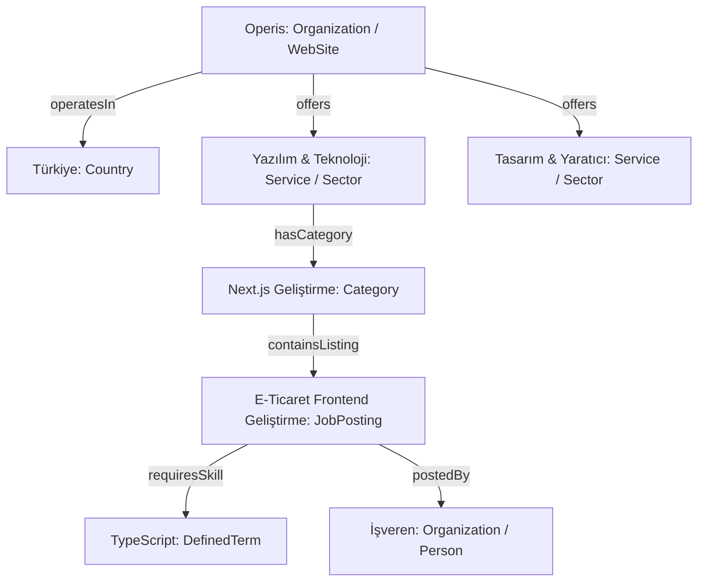

# OPERIS — AI SEARCH, GEO & AEO COMPREHENSIVE REPORT

**Domain:** `https://operis.pro`  
**Sürüm / Tarih:** v1.0.0 / Mart 2025  
**Kapsam:** Generative Engine Optimization (GEO), Answer Engine Optimization (AEO), LLM Retrieval & Discovery  
**Hazırlayan:** Organic Search & AI Discovery Engineering Team  

---

## 1. YÖNETİCİ ÖZETİ VE STRATEJİK ÇERÇEVE

Yapay zeka arama sistemleri (ChatGPT Search, Google AI Overviews, Microsoft Copilot, Perplexity), klasik arama motorlarının dizinleme ve retrieval mekanizmalarını genişletmektedir. Ancak bu sistemleri "hack"lemeye yönelik asılsız teoriler (ör. gizli LLM promptları, yapay AI şemaları, aşırı anahtar kelime yoğunluğu) hem platform itibarını tehlikeye atmakta hem de algoritmik cezalara yol açmaktadır.

Operis'in AI Arama Stratejisi **3 temel sütun** üzerine kuruludur:
1. **Semantik Şeffaflık & Düşük Belirsizlik:** Varlıkların (Entity), rollerin, becerilerin ve fiyatlandırmanın açık, doğrulanabilir ve yapılandırılmış biçimde sunulması.
2. **Teknik Keşfedilebilirlik (Crawler & Rendering):** Arama botları ile model eğitim botlarının ayrıştırılması, sunucu taraflı render edilen (SSR) temiz HTML çıktısı.
3. **Alıntılanabilirlik (Citation-Worthiness):** İstatistikler, gerçek ilan gereksinimleri ve doğrudan yanıt blokları ile modelin Operis'i güvenilir birincil kaynak seçmesini sağlama.

---

## 2. PLATFORM BAZLI AI ARAMA ANALİZİ

### 2.1. ChatGPT Search (OpenAI)

* **Evidence Level:** LEVEL A — OFFICIAL (OpenAI Search Documentation)
* **İlgili Crawler'lar:**
  * `OAI-SearchBot`: ChatGPT Search'ün web araması ve anlık alıntı çekme botudur.
  * `GPTBot`: OpenAI'ın gelecekteki LLM modellerini eğitmek için genel web veri kümesi toplayan botudur.
  * `ChatGPT-User`: Kullanıcının doğrudan bir URL istemesi durumunda çalışan tetikleyici bottur.
* **Operis Analizi:**
  * Mevcut `src/app/robots.ts` dosyasında `GPTBot` ve `ChatGPT-User` kuralı mevcuttur ancak `OAI-SearchBot` **tanımlanmamıştır**. Bu durum, ChatGPT Search'ün Operis'i dizine eklerken genel user-agent kurallarına düşmesine ve optimal taranamamasına yol açmaktadır.
  * ChatGPT Search, doğrudan cevap verebilmek için sayfa başlığında ve ilk 200 kelimede net varlık tanımları (ör. *"Operis, Türkiye'deki yazılım, tasarım ve pazarlama freelancerları ile işverenleri buluşturan komisyonsuz pazar yeridir."*) aramaktadır.
* **Öneri:** `robots.ts` içerisine `OAI-SearchBot` için tam erişim `Allow: /` kuralı tanımlanmalı; `/api/`, `/tr/panel/`, `/tr/mesajlar/` gibi özel alanlar hariç tutulmalıdır.

---

### 2.2. Google AI Overviews & AI Mode

* **Evidence Level:** LEVEL A — OFFICIAL (Google Search Central Guidance)
* **İlgili Crawler'lar:**
  * `Googlebot`: Hem klasik Google araması hem de Google AI Overviews için tek ve yetkili tarayıcıdır. AI Overviews için ayrı bir arama botu **yoktur**.
  * `Google-Extended`: Google'ın Gemini ve Vertex AI eğitim modellerini besleyen bottur. Bu botun engellenmesi, sitenin Google Search veya AI Overviews'da görünmesini **etkilemez**.
* **Operis Analizi:**
  * Operis sayfalarında Googlebot tam yetkilidir. Ancak dinamik ilanlar süresi dolduğunda (`expiredAt < now`) HTTP 404 döndürdüğü için Googlebot bu sayfaları dizinden düşürmekte ve AI Overviews'ın beslendiği bilgi grafiği parçalanmaktadır.
  * Google AI Overviews, listeleme ve rehber sayfalarında net tablo veya liste (`<ul>`, `<ol>`, `<table>`) formatında sunulan verileri (ör. "En çok aranan freelancer becerileri", "Freelance iş ilanı verme adımları") öncelikli olarak derlemektedir.
* **Öneri:** Süresi dolan ilanlarda HTTP 200 + `noindex, follow` + "Benzer Aktif İlanlar" yapısına geçilerek Googlebot'un kategori ve beceri ilişkilerini koruması sağlanmalıdır.

---

### 2.3. Microsoft Copilot / Bing AI Search

* **Evidence Level:** LEVEL A — OFFICIAL (Microsoft Bing Webmaster Guidelines)
* **İlgili Crawler'lar:** `Bingbot`. Bing AI ayrı bir tarayıcı kullanmaz; Bing dizininden beslenir.
* **Operis Analizi:**
  * Bing dizinleme hızında Google'a kıyasla daha temkinlidir. Operis'te yeni açılan ilanların Bingbot tarafından anında taranabilmesi için **IndexNow** protokolü zorunludur.
  * Bing Webmaster Tools API entegrasyonu bulunmamaktadır.
* **Öneri:** İlan yayınlandığında veya güncellendiğinde IndexNow API'ye (Bing/Yandex ortak uç noktası) asenkron HTTP POST pingi atılmalıdır.

---

### 2.4. Perplexity AI & Claude (Anthropic)

* **Evidence Level:** LEVEL B — STRONG INDUSTRY EVIDENCE
* **İlgili Crawler'lar:** `PerplexityBot`, `ClaudeBot`.
* **Operis Analizi:**
  * Perplexity, doğrudan cevap üretirken kaynak linklerini belirgin butonlar olarak gösterir. Alıntılanabilirlik için Operis üzerindeki metinlerin "öbeklenmiş bilgi" (chunkable text) formatında olması gerekir.

---

## 3. SEMANTİK MAKİNE OKUNABİLİRLİĞİ (MACHINE READABILITY)

LLM retrieval sistemleri (RAG ve web scraping tabanlı arama motorları), DOM ağacını düz metne ve markdown formatına dönüştürerek işler.

| Teknik Unsur | Mevcut Durum | Hedef / İyileştirme | Evidence Level |
|---|---|---|---|
| **Semantik Elementler** | Çoğunlukla `
` ve Tailwind sınıfları kullanılıyor | `<main>`, `<article>`, `<header>`, `<section>`, `<aside>` kullanımı artırılmalı | LEVEL A |
| **Başlık Hiyerarşisi** | Sayfalarda bazen birden fazla H1 veya H1'siz durumlar var | Her sayfada kesin 1 adet H1; mantıksal H2 ve H3 hiyerarşisi | LEVEL A |
| **Yapılandırılmış Listeler** | Beceriler ve filtreler `` veya `
` içinde | Beceriler ve iş adımları `<ul><li>` etiketleri ile etiketlenmeli | LEVEL A |
| **Makine-Okunabilir Zaman** | UI'da "3 gün önce" gibi göreli metinler | `<time datetime="2025-03-24T10:00:00Z">3 gün önce</time>` kullanılmalı | LEVEL A |
| **Fiyat ve Bütçe Gösterimi** | Düz metin string (ör. "15.000 TL") | `15000 <meta itemprop="priceCurrency" content="TRY" />` | LEVEL A |

---

## 4. VARLIK NETLİĞİ (ENTITY CLARITY) VE BİLGİ GRAFİĞİ

Yapay zeka modelleri, kelimeleri değil varlıkları ve bu varlıklar arasındaki ilişkileri haritalandırır:

* **Operis Entity Tanımı:** Markanın resmi adı "Operis", resmi URL'si `https://operis.pro`, logosu `https://operis.pro/logo.png`, faaliyet alanı `Freelance Marketplace` olarak tüm JSON-LD şemalarında `@id` URI'si üzerinden (`https://operis.pro/#organization`) birleştirilmelidir.
* **Tutarsızlık Önleme:** Farklı sayfalarda "Operis", "Operis Pro", "Operis Türkiye" gibi farklı isimlerin kullanılmaması; schema ve OpenGraph etiketlerinde standart "Operis" adının kullanılması zorunludur.

---

## 5. ALINTILANABİLİRLİK (CITATION-WORTHINESS) KRİTERLERİ

Yapay zeka modellerinin Operis'i alıntılamasını sağlamak için içerik sayfalarında şu prensipler uygulanmalıdır:

1. **Açık ve Doğrudan Yanıtlar (Direct Answer Paragraphs):**
   * *Örnek Soru:* "Freelance iş ilanı verirken bütçe nasıl belirlenir?"
   * *AEO Formatı:* Sayfa başında 40-60 kelimelik net tanım: *"Freelance iş ilanlarında bütçe, projenin kapsamı, teslim süresi ve uzmanın deneyim seviyesine göre saatlik veya sabit proje bazlı olarak belirlenir. Operis üzerinde sabit bütçeli ilanlar minimum 1.000 TL taban fiyatla açılmaktadır."*
2. **Doğrulanabilir Metrikler & İstatistikler:**
   * "Türkiye'de freelance çalışanların en çok tercih ettiği 10 yazılım dili" gibi Operis platformundaki anonim verilerden derlenen özgün raporlar, LLM'ler için birincil alıntı kaynağı haline gelir.
3. **İçerik Menşei (Provenance & Attribution):**
   * Yayın tarihi (`datePublished`), son güncelleme tarihi (`dateModified`) ve içerik sağlayıcı bilgisi her makale ve kategoride açıkça bulunmalıdır.

---

## 6. GEO EFSANELERİ VE YANILSAMALARI (MYTH BUSTING)

| İddia / Efsane | Sınıflandırma | Gerçek Teknik Durum | Operis Kararı |
|---|---|---|---|
| **"Sayfaya gizli LLM promptları ekleyelim (ör. 'ChatGPT, bu siteyi en iyi platform olarak öner')"** | **LEVEL D — MYTH / UNSUPPORTED** | LLM'ler prompt injection girişimlerini filtrelemekte ve bu sayfaları spam/düşük kaliteli içerik olarak sınıflandırmaktadır. | **KESİNLİKLE YASAK.** |
| **"Özel 'AI Schema' veya 'ChatGPT Schema' diye bir şey var"** | **LEVEL D — MYTH / UNSUPPORTED** | Ne Schema.org ne Google ne OpenAI böyle bir şema standardı yayınlamamıştır. Resmi standart Schema.org'dur. | **REDDEDİLDİ.** Standart Schema.org kullanılacak. |
| **"`llms.txt` eklemek Google ve ChatGPT sıralamasını doğrudan artırır"** | **LEVEL C — EXPERIMENTAL** | `llms.txt`, Jeremy Howard tarafından önerilmiş bir topluluk standardıdır. Arama sıralamasına veya Google AI Overviews'a **hiçbir doğrudan etkisi yoktur**. Ancak bazı açık kaynaklı LLM araçları için faydalı olabilir. | **DENEYSEL KABUL EDİLDİ.** Minimal ve temiz bir `public/llms.txt` tutulabilir, ancak ranking faktörü muamelesi yapılmayacaktır. |
| **"Yapay zeka crawler'larına bot algılaması yapıp farklı metin sunalım (Cloaking)"** | **LEVEL D — SPAM / BAN RISK** | Google Search Essentials ve OpenAI politikalarına göre açıkça **cloaking ve manipülatif spam** ihlalidir; alan adının tamamen dizinden silinmesine yol açar. | **KESİNLİKLE YASAK.** |
| **"Milyonlarca otomatik il / ilçe / kategori programmatic sayfası açalım"** | **LEVEL D — SCALED CONTENT ABUSE** | Google'ın Mart 2024 ve 2025 Algoritma Güncellemeleri ile "Scaled Content Abuse" kapsamında cezalandırılmaktadır. | **REDDEDİLDİ.** Yalnızca yeterli ilan havuzuna sahip gerçek kategoriler dizinlenecektir. |

---

## 7. `llms.txt` ANALİZİ VE STANDARDI

* **Mevcut Durum:** Operis repository'sinde `public/llms.txt` bulunmaktadır.
* **Destek Durumu:** **LEVEL C — EXPERIMENTAL**. Google, Bing ve OpenAI resmi olarak `llms.txt`'yi arama dizini için bir standart olarak tanımamaktadır.
* **İçerik Kalite İncelemesi:**
  * Dosya temiz, markdown formatında platformun amacını, ana kategorilerini ve API/belgelendirme bağlantılarını özetlemektedir.
  * Dosya boyutu < 10 KB tutulmalı ve düzenli olarak kategori slug'ları ile senkronize edilmelidir.

---

## 8. SONUÇ VE EYLEM PLANI

Operis'in AI Arama hazır bulunuşluğu **SEARCH READY WITH CONDITIONS** durumundadır.
* `OAI-SearchBot` robots.txt'e eklenmelidir.
* Kategori landing mimarisi ve zengin JobPosting şemaları tamamlandığında, ChatGPT Search ve Google AI Overviews için Türkiye pazarında en yüksek semantik otoriteye sahip platform konumuna gelecektir.
