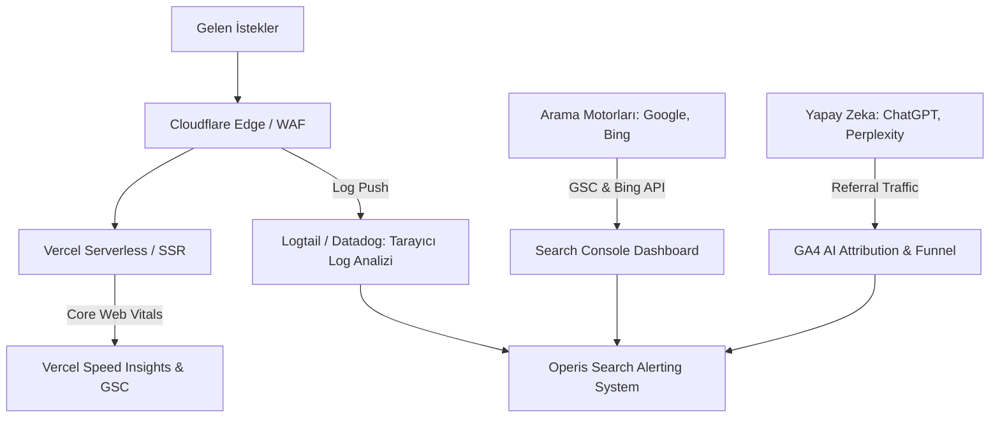

# OPERIS — POST-LAUNCH SEARCH & AI OBSERVABILITY FRAMEWORK

**Domain:** `https://operis.pro`  
**Sürüm / Tarih:** v1.0.0 / Mart 2025  
**Kapsam:** Canlı Sonrası Arama Motoru, Yapay Zeka Keşfi ve Performans İzleme Stratejisi  
**Hazırlayan:** Search Observability & Site Reliability Engineering Team  

---

## 1. GÖZLEMLENEBİLİRLİK MİMARİSİ VE METRİKLER

Operis platformu, canlıya geçtikten sonra yalnızca standart Google Analytics trafiğiyle izlenemez. Tarayıcı aktiviteleri, indeksleme sıhhati, yapay zeka yönlendirmeleri ve teknik hatalar için katmanlı bir gözlemlenebilirlik mimarisi gereklidir:

---

## 2. DÖNEMSEL İZLEME TAKVİMİ

### 2.1. İlk Gün (First Day — T+0 to T+24h)
* **Sıklık:** Saatlik kontrol.
* **Metrikler:**
  * Robots.txt erişilebilirliği (HTTP 200) ve kural bütünlüğü.
  * XML Sitemap status ve parsing durumu (GSC üzerinde "Başarılı" bildirimi).
  * Cloudflare WAF üzerinde bot bloklama logları (özellikle `Googlebot`, `Bingbot`, `OAI-SearchBot` engellenmemeli).
  * İlk sunucu yanıt süreleri (TTFB < 250ms).

### 2.2. İlk Hafta (First Week — Günlük Takip)
* **Sıklık:** Günlük sabah kontrolleri.
* **Metrikler:**
  * Dizinlenen URL sayısı artış eğilimi (GSC "Sayfalar" sekmesi).
  * "Taranmış - şu anda dizine eklenmemiş" grafiği (kalite sorunlarının erken teşhisi).
  * 404 ve 5xx hata artışları.
  * IndexNow API başarı/hata oranları (Bing Webmaster Tools).
  * Zengin Sonuçlar (Rich Results) geçerlilik oranı (JobPosting şeması).

### 2.3. İlk Ay (First Month — Haftalık Değerlendirme)
* **Sıklık:** Haftalık gözden geçirme toplantısı.
* **Metrikler:**
  * Organik Arama Gösterimleri (Impressions), Tıklamalar (Clicks), Ortalama TO (CTR) ve Ortalama Konum.
  * Kategori bazlı organik trafik dağılımı (Hangi kategoriler en hızlı sıralama alıyor?).
  * AI Arama Yönlendirme Trafiği (`chatgpt.com`, `perplexity.ai`, `bing.com` referral oturumları ve kayıt dönüşümleri).
  * Core Web Vitals Saha Verisi (LCP, INP, CLS yeşil alan yüzdesi).

### 2.4. Aylık & Çeyreklik (Monthly & Quarterly — Stratejik İnceleme)
* **Sıklık:** Ayda 1 ve çeyrekte 1 kez.
* **Metrikler:**
  * Tarama Bütçesi Verimliliği: Googlebot'un ziyaret ettiği URL'lerin kaçı faydalı sayfa, kaçı parametreli/çöp URL?
  * Varlık Otoritesi (Topical Authority): Sektörel aramalarda Operis'in Türkiye pazarındaki pazar payı.
  * İçerik Bozulması (Content Decay): Süresi dolan ilanların platform içi otoriteye etkisi.

---

## 3. SUNUCU LOG ANALİZ PLANI (SERVER LOG ANALYSIS)

Arama motoru optimizasyonunda tek kesin gerçek sunucu loglarıdır. Googlebot ve AI botlarının gerçek davranışları Cloudflare ve Vercel logları üzerinden izlenmelidir.

### İzlenecek User-Agent'lar:
1. `Googlebot` (Desktop & Smartphone)
2. `Bingbot`
3. `OAI-SearchBot` (ChatGPT Search)
4. `GPTBot` (OpenAI Training)
5. `Google-Extended` (Gemini Training)
6. `PerplexityBot`

### Takip Edilecek KPI'lar:
* **Günlük Tarama Hacmi (Daily Hit Count):** Botların günlük toplam istek sayısı.
* **Durum Kodu Dağılımı (Status Code Distribution):**
  * %90+ HTTP 200 (Hedef)
  * < %5 HTTP 301/308
  * < %1 HTTP 404/410
  * %0 HTTP 5xx
* **Tarama Gecikmesi (Crawl Latency):** Bot isteklerine verilen ortalama sunucu yanıt süresi. > 500ms tarama hızını yavaşlatır.
* **En Sık Taranan Rotalar:** İlanlar mı, kategoriler mi yoksa filtreli çöp URL'ler mi taranıyor?

---

## 4. YAPAY ZEKA ARAMA ATIF VE DÖNÜŞÜM TAKİBİ (AI ATTRIBUTION)

AI arama motorlarından gelen kullanıcılar klasik organik arama kullanıcılarına göre daha spesifik ve yüksek dönüşüm potansiyeline sahiptir.

### GA4 Özel Segmentasyonu:
Aşağıdaki yönlendirme kaynakları (Referral Source) "AI Organic" olarak etiketlenmelidir:
* `chatgpt.com` / `android-app://com.openai.chatgpt`
* `perplexity.ai`
* `bing.com` (Copilot arayüzünden gelenler)
* `claude.ai`
* `gemini.google.com`

### İzlenecek AI Dönüşüm Metrikleri:
1. **AI Referral Sessions:** Yapay zekadan gelen toplam oturum sayısı.
2. **AI User Signup Rate:** AI üzerinden gelip kayıt olan kullanıcı oranı.
3. **AI Listing Creation Rate:** AI tavsiyesiyle gelip ilan açan işveren oranı.
4. **AI Proposal Submission Rate:** AI ile gelip ilana teklif veren freelancer oranı.

---

## 5. ALARM VE UYARI KURALLARI (SEO ALERTING SYSTEM)

Aşağıdaki durumlarda DevOps ve SEO ekiplerine derhal Slack / Email / PagerDuty uyarısı gönderilmelidir:

| Alarm Kodu | Tetikleyici Durum | Seviye | Eylem |
|---|---|---|---|
| **ALERT-01** | `robots.txt` dosyasının HTTP 404/500 dönmesi veya `Disallow: /` içermesi | **SEV-1 (BLOCKER)** | Anında acil dağıtım; site taramasının durması engellenir. |
| **ALERT-02** | Ana sayfa (`/tr`) veya `/tr/ilanlar` üzerinde `noindex` etiketinin belirmesi | **SEV-1 (BLOCKER)** | Anında geri alma (rollback) veya hotfix. |
| **ALERT-03** | 24 saat içinde 404 hatalarında %50'den fazla ani artış | **SEV-2 (CRITICAL)** | URL lifecycle ve slug yönlendirmeleri denetlenir. |
| **ALERT-04** | XML Sitemap'in oluşturulamaması veya 500 hatası vermesi | **SEV-2 (CRITICAL)** | `src/app/sitemap.ts` veri tabanı sorgusu optimize edilir. |
| **ALERT-05** | Googlebot tarama isteklerinde %70'ten fazla ani düşüş | **SEV-2 (CRITICAL)** | WAF kuralları ve Cloudflare bot engellemeleri kontrol edilir. |
| **ALERT-06** | JobPosting şemasında Google Search Console hata artışı | **SEV-3 (HIGH)** | Şema şablonundaki veri tutarlılığı düzeltilir. |
