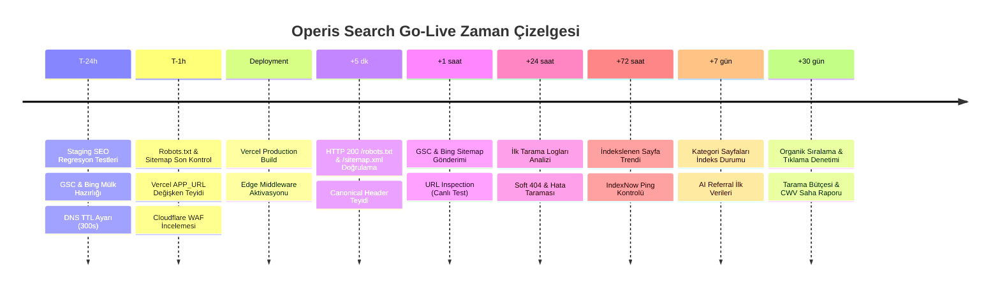

# OPERIS — SEARCH GO-LIVE OPERATIONAL RUNBOOK & CHECKLIST

**Domain:** `https://operis.pro`  
**Sürüm / Tarih:** v1.0.0 / Mart 2025  
**Kapsam:** Canlıya Geçiş (Go-Live) Aşamalı Arama Motoru ve Yapay Zeka Operasyon Planı  
**Hazırlayan:** Organic Search & AI Discovery Engineering Team  

---

## 1. ZAMAN ÇİZELGESİ VE OPERASYONEL FAZLAR

---

## 2. AŞAMALI DETAYLI KONTROL LİSTESİ

### 2.1. T-24 Saat (Hazırlık ve Dondurma)
- [ ] **GSC Mülk Doğrulaması:** Google Search Console'da DNS TXT kaydı (`cloudflare` üzerinden) ile Domain Mülkü (`operis.pro`) önceden doğrulanmış olmalıdır.
- [ ] **Bing Webmaster Tools Kurulumu:** Bing Webmaster Tools'a GSC hesabı üzerinden yetki verilerek mülk senkronize edilmelidir.
- [ ] **DNS TTL Düşürme:** Cloudflare üzerinde `operis.pro` A / CNAME kayıtlarının TTL süresi 300 saniyeye (5 dk) çekilmelidir (olası geri alma durumunda hızlı yönlendirme için).
- [ ] **Staging SEO CI Koşumu:** Vitest SEO test süitinin tüm testlerden (`robots.test.ts`, `sitemap.test.ts`, `canonical.test.ts`, `schema.test.ts`) başarıyla geçtiği doğrulanmalıdır.

---

### 2.2. T-1 Saat (Son Dağıtım Öncesi Güvenlik Kontrolü)
- [ ] **Environment Değişkenleri:** Vercel Production ortamında `APP_URL=https://operis.pro` ve `INDEXNOW_KEY` değişkenlerinin tanımlı olduğu teyit edilmelidir.
- [ ] **Cloudflare Bot Management:** Googlebot, Bingbot, OAI-SearchBot gibi doğrulanmış botların WAF Managed Rules veya Rate Limiting kurallarına takılmadığı teyit edilmelidir.
- [ ] **Noindex Temizliği:** Staging sırasında test amaçlı eklenmiş olabilecek global `X-Robots-Tag: noindex` veya meta noindex etiketlerinin production build'inde yer almadığı doğrulanmalıdır.

---

### 2.3. Dağıtım Anı (Deployment Execution)
- [ ] **Production Release:** `main` dalından Vercel Production Deploy tetiklenir.
- [ ] **Edge Middleware & Proxy Kontrolü:** `src/proxy.ts` kurallarının çalıştığı ve trailing-slash veya www yönlendirmelerinin HTTP 308/301 ile temiz yapıldığı izlenir.

---

### 2.4. +5 Dakika (İlk Sağlık ve Yayılma Kontrolü)
- [ ] **Robots.txt Kontrolü:** `curl -sL https://operis.pro/robots.txt` çalıştırılarak status 200 ve doğru içerik doğrulanır.
- [ ] **Sitemap Index Kontrolü:** `curl -sL https://operis.pro/sitemap.xml` çalıştırılarak XML yapısı, URL sayıları ve HTTP 200 status teyit edilir. Hiçbir URL'in 301 yönlendirmesi dönmediği doğrulanır.
- [ ] **Canonical URL Kontrolü:** Ana sayfa, `/tr/ilanlar`, `/tr/kategoriler` kaynak kodları incelenerek `<link rel="canonical">` etiketlerinin eksiksiz ve `https://operis.pro/...` ile başladığı kontrol edilir.

---

### 2.5. +1 Saat (Arama Motoru Kayıt ve Manuel URL Testi)
- [ ] **Sitemap Gönderimi:** Google Search Console ve Bing Webmaster Tools arayüzlerinden `https://operis.pro/sitemap.xml` adresi gönderilir.
- [ ] **GSC URL Denetimi (Live Test):**
  * Ana sayfa (`/tr`)
  * İlanlar ana sayfası (`/tr/ilanlar`)
  * Örnek bir kategori sayfası (`/tr/kategori/web-yazilim`)
  * Örnek bir aktif ilan sayfası (`/tr/ilanlar/[slug]`)
  canlı test edilerek "URL Google tarafından kullanılabilir" onayı alınır.
- [ ] **Zengin Sonuç Doğrulaması:** JobPosting ve BreadcrumbList şemalarının GSC Canlı Testinde yeşil tik aldığı doğrulanır.

---

### 2.6. +24 Saat (İlk Tarama Dalgası ve Hata Analizi)
- [ ] **Vercel / Cloudflare Logları:** Googlebot ve Bingbot istekleri filtrelenir; 4xx veya 5xx hata üreten sayfalar olup olmadığı denetlenir.
- [ ] **GSC Sayfa Dizinleme Raporu:** "Taranmış - şu anda dizine eklenmemiş" veya "Sunucu hatası (5xx)" durumundaki URL'ler incelenir.
- [ ] **ChatGPT Search Erişimi:** ChatGPT Search üzerinde `site:operis.pro` sorgusu veya doğrudan platform sorguları çalıştırılarak botun Operis'i kaynak gösterip göstermediği izlenir.

---

### 2.7. +72 Saat (Dizinlenme ve IndexNow Kontrolü)
- [ ] **IndexNow Başarısı:** Yayınlanan ve süresi dolan yeni ilanların Bing IndexNow API'ye ulaşıp ulaşmadığı loglardan teyit edilir.
- [ ] **Dizin Kapsamı:** Ana sayfa ve ana kategorilerin Google dizinine girmeye başladığı doğrulanır.
- [ ] **Soft 404 Taraması:** Süresi dolan ilanların HTTP 200 + noindex dönüp dönmediği ve GSC'de Soft 404 uyarısı üretip üretmediği kontrol edilir.

---

### 2.8. +7 Gün (Haftalık Değerlendirme ve Performans)
- [ ] **Tüm 110 Kategorinin Dizinlenme Oranı:** Kategori landing sayfalarının dizine eklenme yüzdesi hesaplanır (Hedef: > %90).
- [ ] **Core Web Vitals:** GSC Sayfa Deneyimi ve Lighthouse saha verileri (LCP < 2.5s, INP < 200ms, CLS < 0.1) denetlenir.
- [ ] **İlk AI Referral Trafiği:** Google Analytics 4 üzerinde referrer olarak `chatgpt.com`, `perplexity.ai`, `bing.com` kaynakları izlenir.

---

### 2.9. +30 Gün (Aylık İnceleme ve Stratejik Ayarlamalar)
- [ ] **Organik Arama Performansı:** GSC Performans sekmesinde gösterim (impressions), tıklama (clicks) ve ortalama konum raporlanır.
- [ ] **İlan Havuzu Sağlığı:** Süresi dolmuş ilanların noindex temizliği ve aktif ilanların dizin tazeliği (freshness) denetlenir.
- [ ] **Topical Authority Analizi:** Operis'in Türkiye'deki freelance arama sorgularında (ör. "freelance yazılımcı bul", "next.js iş ilanı") varlık kazanımı değerlendirilir.
