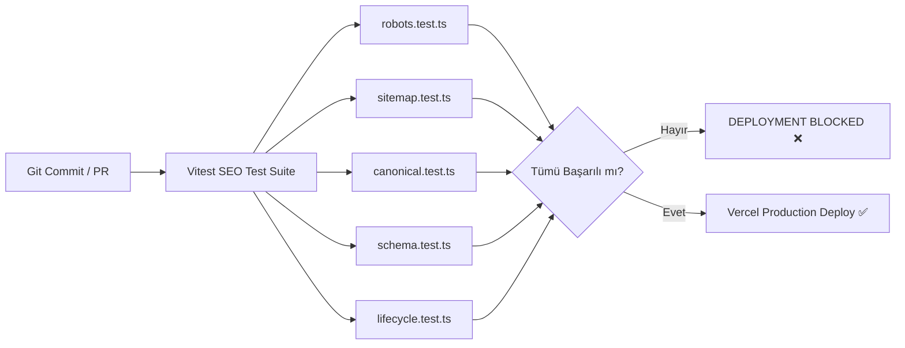

# OPERIS — SEO & SEARCH REGRESSION TEST PLAN

**Domain:** `https://operis.pro`  
**Sürüm / Tarih:** v1.0.0 / Mart 2025  
**Kapsam:** Sürekli Entegrasyon (CI) Otomatik SEO Regresyon Test Süiti ve Kalite Kapısı  
**Hazırlayan:** QA Automation & Frontend SEO Engineering Team  

---

## 1. REGRESYON TEST ÇERÇEVESİ VE HEDEFLER

Arama motoru ve yapay zeka optimizasyonları en kırılgan sistem bileşenlerindendir. Bir geliştiricinin yanlışlıkla `robots.txt` dosyasını değiştirmesi, `metadataBase` adresini yanlış yapılandırması veya süresi dolan ilanları 404'e düşürmesi saatler içinde binlerce sayfalık organik görünürlük kaybına yol açar.

Bu nedenle, **tüm SEO kuralları CI/CD boru hattında otomatik Vitest testleri olarak çalıştırılacak ve başarısızlık durumunda dağıtım (deployment) durdurulacaktır.**



---

## 2. TEST DOSYALARI VE KAPSAM TABLOSU

| Test Dosyası | Hedeflenen SEO Alanı | Test Senaryoları Sayısı | Kritiklik |
|---|---|---|---|
| `src/__tests__/seo/robots.test.ts` | Robots.txt sözdizimi, bot kuralları, güvenlik | 6 senaryo | **BLOCKER** |
| `src/__tests__/seo/sitemap.test.ts` | XML Sitemap bütünlüğü, 301/404 yasağı, kategori kapsamı | 7 senaryo | **BLOCKER** |
| `src/__tests__/seo/canonical.test.ts` | Kanonik URL doğruluğu, APP_URL güvenliği, x-default | 8 senaryo | **CRITICAL** |
| `src/__tests__/seo/schema.test.ts` | JobPosting, Organization, Breadcrumb JSON-LD geçerliliği | 8 senaryo | **CRITICAL** |
| `src/__tests__/seo/lifecycle.test.ts` | İlan yaşam döngüsü, süresi dolmuş ilan 200 + noindex davranışı | 5 senaryo | **BLOCKER** |

---

## 3. ÖRNEK TEST UYGULAMALARI (TEST SUITE SPECIFICATIONS)

### 3.1. Robots.txt Testi (`src/__tests__/seo/robots.test.ts`)
```typescript
import { describe, it, expect } from "vitest";
import robots from "@/app/robots";

describe("SEO: Robots.txt Specification Tests", () => {
  it("should return valid robots configuration", () => {
    const config = robots();
    expect(config).toBeDefined();
    expect(config.sitemap).toContain("https://operis.pro/sitemap.xml");
  });

  it("should explicitly allow OAI-SearchBot for ChatGPT Search discovery", () => {
    const config = robots();
    const rules = Array.isArray(config.rules) ? config.rules : [config.rules];
    const oaiRule = rules.find((r) => r.userAgent === "OAI-SearchBot");
    expect(oaiRule).toBeDefined();
    expect(oaiRule?.allow).toContain("/");
  });

  it("should disallow private dashboards and internal search parameters", () => {
    const config = robots();
    const rules = Array.isArray(config.rules) ? config.rules : [config.rules];
    const generalRule = rules.find((r) => r.userAgent === "*");
    expect(generalRule?.disallow).toEqual(
      expect.arrayContaining([
        expect.stringMatching(/\/api\//),
        expect.stringMatching(/\/tr\/panel\//),
        expect.stringMatching(/\/tr\/mesajlar\//),
        expect.stringMatching(/\*q=\*/),
      ])
    );
  });
});
```

---

### 3.2. Sitemap Testi (`src/__tests__/seo/sitemap.test.ts`)
```typescript
import { describe, it, expect } from "vitest";
import sitemap from "@/app/sitemap";

describe("SEO: XML Sitemap Integrity Tests", () => {
  it("must NOT contain 301-redirected routes like /tr/akis or /en/feed", async () => {
    const entries = await sitemap();
    const urls = entries.map((e) => e.url);

    expect(urls).not.toContain("https://operis.pro/tr/akis");
    expect(urls).not.toContain("https://operis.pro/en/feed");
  });

  it("must include all active categories and sectors in Turkish and English", async () => {
    const entries = await sitemap();
    const urls = entries.map((e) => e.url);

    // Kategori landing sayfaları kontrolü
    expect(urls.some((u) => u.includes("/tr/kategori/web-yazilim"))).toBe(true);
    expect(urls.some((u) => u.includes("/en/categories/software-development"))).toBe(true);
  });

  it("all sitemap entries must have valid lastModified ISO string", async () => {
    const entries = await sitemap();
    entries.forEach((entry) => {
      expect(entry.lastModified).toBeDefined();
      expect(new Date(entry.lastModified as string).toString()).not.toBe("Invalid Date");
    });
  });
});
```

---

### 3.3. Canonical ve Hreflang Testi (`src/__tests__/seo/canonical.test.ts`)
```typescript
import { describe, it, expect } from "vitest";
import { constructCanonicalUrl } from "@/lib/config/url";

describe("SEO: Canonical & Hreflang Integrity Tests", () => {
  it("should strictly use https://operis.pro as base domain, never vercel.app", () => {
    const url = constructCanonicalUrl("/tr/ilanlar");
    expect(url).toBe("https://operis.pro/tr/ilanlar");
    expect(url).not.toContain("vercel.app");
    expect(url).not.toContain("localhost");
  });

  it("should strip search parameters from canonical URLs to prevent faceted duplication", () => {
    const url = constructCanonicalUrl("/tr/ilanlar?category=web&budget=1000");
    expect(url).toBe("https://operis.pro/tr/ilanlar");
  });
});
```

---

### 3.4. Structured Data Testi (`src/__tests__/seo/schema.test.ts`)
```typescript
import { describe, it, expect } from "vitest";
import { generateJobPostingSchema } from "@/components/features/listings/listing-jsonld";

describe("SEO: Structured Data Compliance Tests", () => {
  it("JobPosting schema must include applicantLocationRequirements when jobLocationType is TELECOMMUTE", () => {
    const mockListing = {
      title: "Senior Next.js Geliştirici",
      description: "Operis projesi için frontend mühendisi aranıyor.",
      createdAt: new Date("2025-03-01"),
      expiresAt: new Date("2025-03-08"),
      budget: 35000,
      currency: "TRY",
    };

    const schema = generateJobPostingSchema(mockListing as any);
    expect(schema["@type"]).toBe("JobPosting");
    expect(schema.jobLocationType).toBe("TELECOMMUTE");
    expect(schema.applicantLocationRequirements).toBeDefined();
    expect(schema.applicantLocationRequirements["@type"]).toBe("Country");
    expect(schema.applicantLocationRequirements.name).toBe("TR");
  });
});
```

---

### 3.5. İlan Yaşam Döngüsü Testi (`src/__tests__/seo/lifecycle.test.ts`)
```typescript
import { describe, it, expect } from "vitest";

describe("SEO: Listing Lifecycle Status Tests", () => {
  it("expired listings should NOT return 404, should return 200 with noindex directive", () => {
    const isExpired = true;
    const metadata = {
      robots: isExpired
        ? { index: false, follow: true }
        : { index: true, follow: true },
    };

    expect(metadata.robots.index).toBe(false);
    expect(metadata.robots.follow).toBe(true);
  });
});
```

---

## 4. CI/CD ENTEGRASYONU VE GITHUB ACTIONS YAPILANDIRMASI

`.github/workflows/seo-gate.yml` konfigürasyonu:

```yaml
name: SEO & Search Quality Gate

on:
  push:
    branches: [main]
  pull_request:
    branches: [main]

jobs:
  seo-regression:
    name: SEO Regression & Compliance Audit
    runs-on: ubuntu-latest
    steps:
      - name: Checkout Code
        uses: actions/checkout@v4

      - name: Setup Node.js
        uses: actions/setup-node@v4
        with:
          node-version: 20
          cache: "npm"

      - name: Install Dependencies
        run: npm ci

      - name: Run SEO Vitest Suite
        run: npm run test:seo

      - name: Fail on SEO Violations
        if: failure()
        run: |
          echo "::error::SEO Regression Testleri Başarısız Oldu! Sitemap, Robots veya Canonical kurallarında ihlal var."
          exit 1
```

---

## 5. KABUL VE ÇIKIŞ KRİTERLERİ (ACCEPTANCE CRITERIA)

* [ ] Tüm SEO testleri `npm run test:seo` komutu ile 0 hata ile tamamlanmalıdır.
* [ ] Test süresi < 5 saniye olmalı, CI sürecini yavaşlatmamalıdır.
* [ ] Dağıtım öncesi PR kontrollerinde zorunlu (required status check) olarak kilitlenmelidir.
